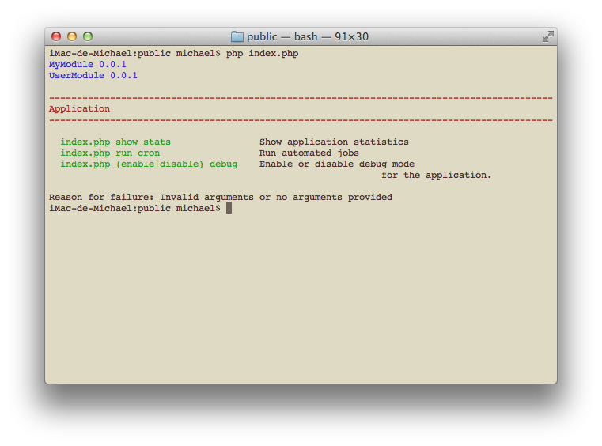

# Modules

zend-mvc-console integrates zend-mvc with zend-console; the integration also works with modules
loaded with the
[Module Manager](http://framework.zend.com/manual/current/en/modules/zend.module-manager.intro.html).

zend-mvc-console ships with a console-specific `RouteNotFoundStrategy` which is
responsible for displaying console usage information when:

- the user has not provided any arguments; or
- arguments could not be matched by any routes.

The strategy currently supports two types of information:
[application banners](#application-banner) and [usage information](#usage-information).

## Application banner

When using the console within a zend-mvc-console-enabled application, you can
invoke it via the application bootstrap:

```bash
$ php public/index.php
```

By default, it will simply output the current ZF 2 version, like this:


Our `Application` module (and any other module) can provide an **application
banner**. In order to do so, our `Module` class has to implement
`Zend\ModuleManager\Feature\ConsoleBannerProviderInterface`. As an example:

```php
// module/Application/Module.php
<?php
namespace Application;

use Zend\ModuleManager\Feature\ConsoleBannerProviderInterface;
use Zend\Console\Adapter\AdapterInterface as Console;

class Module implements ConsoleBannerProviderInterface
{
    /**
     * This method is defined in ConsoleBannerProviderInterface
     */
    public function getConsoleBanner(Console $console)
    {
        return 'MyModule 0.0.1';
    }
}
```

> ### Duck-typing allowed
>
> You can duck-type the interface implementation by implementing the
> `getConsoleBanner()` method without specifically implementing the
> `ConsoleBannerProviderInterface`.

As you can see, the application banner should be a single line string that
returns the module's name and (if available) its current version.

If several modules define their own banner, they are displayed one after the
other in the order in which the modules are loaded. This allows you to see at a
glance which modules expose console commands.

If we execute our console application now, we'll see the newly created banner:


Let's create and load a second module that provides a banner:

```php
<?php
// config/application.config.php
return [
    'modules' => [
        'Application',
        'User', // <- load user module in module/User
    ],
    // ...
];
```

The `User` module will provide info about itself:

```php
// module/User/Module.php
<?php
namespace User;

use Zend\ModuleManager\Feature\ConsoleBannerProviderInterface;
use Zend\Console\Adapter\AdapterInterface as Console;

class Module implements ConsoleBannerProviderInterface
{
    /**
     * This method is defined in ConsoleBannerProviderInterface
     */
    public function getConsoleBanner(Console $console)
    {
        return "User Module 0.0.1";
    }
}
```

Because the `User` module is loaded after the `Application` module, the result
will look like this:


> ### Application banner display
>
> Application banners provided by modules are displayed as-is &mdash; no
> trimming or other adjustments will be performed on the text. As you can see,
> banners are also automatically colorized as blue.

## Usage information

In order to display usage information, our Module class must implement
`Zend\ModuleManager\Feature\ConsoleUsageProviderInterface`. Let's modify our
example and add the new method defined in that interface:

```php
// module/Application/Module.php
<?php
namespace Application;

use Zend\ModuleManager\Feature\ConsoleBannerProviderInterface;
use Zend\ModuleManager\Feature\ConsoleUsageProviderInterface;
use Zend\Console\Adapter\AdapterInterface as Console;

class Module implements
    ConsoleBannerProviderInterface,
    ConsoleUsageProviderInterface
{
    public function getConsoleBanner(Console $console)
    {
        /* ... */
    }

    /**
     * This method is defined in ConsoleUsageProviderInterface
     */
    public function getConsoleUsage(Console $console)
    {
        return [
            'show stats'             => 'Show application statistics',
            'run cron'               => 'Run automated jobs',
            '(enable|disable) debug' => 'Enable or disable debug mode for the application.',
        ];
    }
}
```

> ### Duck-typing allowed
>
> You can duck-type the interface implementation by implementing the
> `getConsoleUsage()` method without specifically implementing the
> `ConsoleUsageProviderInterface`.

This will display the following information:



Similar to [application banners](#application-banner), multiple modules can
provide usage information, which will be joined together and displayed to the
user. The order in which usage information is displayed is the order in which
modules are loaded.

As you can see, the zend-mvc-console integration also prepends each module's
usage with the module's name. This helps to visually separate commands by module
&mdash; which is particularly useful when you have multiple modules providing
commands.  By default, the component colorizes the module names in red.

> ### Usage information is arbitrary
>
> Usage info provided in modules is not connected with [console
> routing](routing.md). You can describe console usage in any form you prefer,
> and it does not affect how MVC handles console commands. In order to handle
> real console requests, you still need to define console routes.

### Free-form text

In order to output free-form text as usage information, `getConsoleUsage()` can
return a string or an array of strings. As an example, the following is a
single, free-form usage text:

```php
public function getConsoleUsage(Console $console)
{
    return 'User module expects exactly one argument - user name. '
        . 'It will display information for the provided user.';
}
```


> ### Usage text is provided as-is
>
> The text provided is displayed as-is; no trimming or other adjustments will
> be performed. If you'd like to fit your usage information inside the console
> window, you could check its width with `$console-getWidth()`.

### List of commands

If `getConsoleUsage()` returns an associative array, it will be automatically
aligned in 2 columns.  The first column will be prepended with script name (the
entry point for the application). This is useful to display the various
commands exposed.

```php
public function getConsoleUsage(Console $console)
{
     return [
        'delete user <userEmail>'        => 'Delete user with email <userEmail>',
        'disable user <userEmail>'       => 'Disable user with email <userEmail>',
        'list [all|disabled] users'      => 'Show a list of users',
        'find user [--email=] [--name=]' => 'Attempt to find a user by email or name',
     ];
}
```


> ### Command list alignment
>
> Commands and their descriptions will be aligned in two columns that fit
> inside the terminal window. If the window is resized, text may wrap, but all
> content will be aligned. If you don't like the behavior, you can always
> return [free-form text](#free-form-text) instead, as free-form text is never
> transformed or aligned.

### List of params and flags

Returning an array of arrays from `getConsoleUsage()` will produce a listing of
parameters. This is useful for explaining flags, switches, possible values and
other information. The output will be aligned in multiple columns for
readability.

As an example:

```php
public function getConsoleUsage(Console $console)
{
    return [
        [ '<userEmail>', 'email of the user' ],
        [ '--verbose',   'Turn on verbose mode' ],
        [ '--quick',     'Perform a "quick" operation' ],
        [ '-v',          'Same as --verbose' ],
        [ '-w',          'Wide output'],
    ];
}
```


This method can be used to display more than 2 columns of information:

```php
public function getConsoleUsage(Console $console)
{
    return [
        [ '<userEmail>', 'user email',        'Full email address of the user to find.' ],
        [ '--verbose',   'verbose mode',      'Display additional information during processing' ],
        [ '--quick',     '"quick" operation', 'Do not check integrity, just make changes and finish' ],
        [ '-v',          'Same as --verbose', 'Display additional information during processing' ],
        [ '-w',          'wide output',       'When listing users, use the whole available screen width' ],
    ];
}
```


> ### Alignment
>
> All information will be aligned in one or more columns that fit inside the
> terminal window. If the window is resized, some text may wrap, but all
> content will remain aligned. In case the number of columns changes (e.g. the
> array contains different number of elements), a new table will be created,
> with its own alignment and column widths.
>
> If you don't like this behavior, you can always return [free-form text](#free-form-text).

### Mixing styles

You can use mix together all of the above styles to provide comprehensive usage information.

```php
public function getConsoleUsage(Console $console)
{
    return [
        'Finding and listing users',
        'list [all|disabled] users [-w]' => 'Show a list of users',
        'find user [--email=] [--name=]' => 'Attempt to find a user by email or name',

        ['[all|disabled]', 'Display all users or only disabled accounts'],
        ['--email=EMAIL',  'Email of the user to find'],
        ['--name=NAME',    'Full name of the user to find.'],
        ['-w',             'Wide output - When listing users use the whole available screen width'],

        'Manipulation of user database:',
        'delete user <userEmail> [--verbose|-v] [--quick]' => 'Delete user with email <userEmail>',
        'disable user <userEmail> [--verbose|-v]'          => 'Disable user with email <userEmail>',

        [ '<userEmail>', 'user email',        'Full email address of the user to change.'],
        [ '--verbose',   'verbose mode',      'Display additional information during processing'],
        [ '--quick',     '"quick" operation', 'Do not check integrity, just make changes and finish'],
        [ '-v',          'Same as --verbose', 'Display additional information during processing'],

    ];
}
```


## Best practices

Here are the best practices when providing usage for your commands:

1. Your module's `getConsoleBanner()` method should return a one-line string
   containing the module's name and its version (if available); do not provide any
   other information.
2. Your `getConsoleUsage()` method should *not* return the module's name, as it
   is prepended automatically for you by the zend-mvc-console integration.
